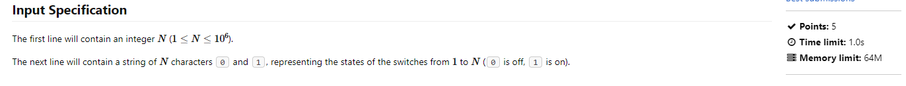

One of the most well known and important concepts found in computer science. It is used almost everywhere in programming, to better analyze and investigate code overall. Analyzing time complexity allows us to determine the **order of magnitude** of a piece of code, giving good insight to the efficiency and (partially) what speed the code will complete execution.
<!--more-->

<center><br /><sub><sup><a href="https://www.bigocheatsheet.com/">Credit</a></sup></sub></center>

## Introduction

Hello, welcome to my first blog post! I've known about time complexity for more than a year now, using the concept several times in the competitive programming field. Although it is not a new concept to me, I decided to write about it as a way to warm up to writing blogs on this website.

---

## Big-O Notation

Time complexity is the estimation of how efficient an algorithm will perform given an input. The efficency is characterized by how many operations it takes to finish the alogrithm given the input, with the input size often expressed as $$ n $$. This is where Big-O notation comes in. Big-O notation is the expression of the worst-case complexity given $$ n $$, represented as a function $$ O(f(x)) $$. By knowing and having the ability to analyze time complexity, it is possible to determine whether an algorithm is fast or slow, even without executing it! This is especially important in competitive programming, where code executes under certain time and memory limits, where efficiency is absolute key. 


## Calculating Time Complexity using Big-O Notation

There are many rules to calculating Big-O Notation, and I will be demonstrating them through following examples.

#### Example 1: 

```cpp
// C++
int a = 2;
int b = -4;
string c = "23";
int d = a+b;
int e; 
cin >> e;
cout << e;
```
```py
# Python
a = 2
b = -4
c = "23"
d = a + b
e = int(input())
print(e)
```

This excerpt of code executes in $$ O(1) $$ time, as there is a **constant** amount of operations. $$ O(1) $$ time is often reffered to as "constant time" as a result. Input and Output are also considered to be $$ O(1) $$ time. Try and analyze the next piece of code without scrolling too far and looking at the answer.

#### Example 2:
```cpp
// C++
int a; 
cin >> a;
int b; 
cin >> b;
int c = 2;
c += (a+b);
sleep(3); // Sleep function to pause program execution for 3 seconds
cout << c;
``` 
```py
# Python
a = int(input())
b = int(input())
c = 2
c += (a+b)
time.sleep(3) # Pause program execution for 3 seconds
print(c)
```
<br />
If you don't want to see the answer, don't scroll down past me!
<br />
<br />
<br />

**Answer: This code runs in $$ O(1) $$ time.**
<br />
**Remember: time complexity is not based off of the amount of time the program takes to execute.** 
<br />
Even if the program is paused for 3 seconds before finishing, it does not mean the time complexity is increased. Time complexity is based off of efficiency, not execution time, especially when execution time may vary from machine to machine, and language to language. Now, let's move onto more complex code, incorporating loops.

#### Example 3:
```cpp
// C++
int count = 0;
for(int i = 1; i <= n; i++){
    count++;
}
cout << count;
```
```py
# Python
count = 0
for i in range(1,n):
    count += 1
print(count)
```

This code executes in $$ O(n) $$ time. The amount of operations is dependent on the size of $$ n $$. Try the next one for yourself.

#### Example 4:
```cpp
// C++
for(int i = 1; i<= n; i++){
    for(int j = 1; j <= n; j++){
        // constant time code here
    }
}
``` 
```py
# Python
for i in range(1, n+1):
    for j in range(1, n+1):
        # constant time code here
```
<br />
If you don't want to see the answer, don't scroll down past me!
<br />
<br />
<br />
<br />
**Answer: This code runs in $$ O(n^2) $$ time.**
Inside the loop that takes $$ n $$ operations, there is another loop that takes another $$ n $$ operations. This gives us $$ n * n = n^2 $$ resulting in a time complexity of $$ O(n^2) $$.


#### Example 5:
```cpp
// C++
for(int i = 0; i < n+23; i++){
    for(int j = 3; j <= n*5+100; j++){
        // constant time code here
    }
}
```
```py
# Python
for i in range(0, n+23):
    for j in range(3, (n+1)*5+100):
        # constant time code here
```

This one may look tricky, but it is actually extremely simple.
The time complexity is $$ O(n^2) $$. <br/>
When analyzing time complexity, ignore constants at all times. The only size that is changing in these loops is $$ n $$ itself. Constants are typically ignored as when the size of $$ n $$ grows closer to infinity, constants provide little to no extra information. Of course, there are situations where constants may be included into the time complexity. When constants are **noticably** large, (e.g $$n*1000$$ when $$ n \le 80 $$), whoever is analyzing the time complexity may choose to include the constant, but it is still completely optional. Try the next example for yourself.

#### Example 6:
```cpp
// C++
for(int i = 1; i<= n; i++){
    for(int j = 0; j <= m; j++){
        // constant time code here
    }
}
for(int i = 0; i <= n; i++){
    // constant time code here
}

``` 
```py
# Python
for i in range(1, n+1):
    for j in range(1, m+1):
        # constant time code here
for i in range(0, n+1):
    # constnat time code here
```
<br />
If you don't want to see the answer, don't scroll down past me!
<br />
<br />
<br />
<br />
**Answer: This code runs in $$ O(nm + n) $$ time.** <br />
Inside the loop that takes $$ n $$ operations, there is another loop that takes another $$ m $$ operations. This gives us $$ n * m = nm $$ resulting in a time complexity of $$ O(nm) $$. Additionally, there is another seperate loop that takes $$ n + 1 $$ operations. We ignore the additional $$ 1 $$, and add it to the total time complexity, resulting in $$ O(nm + n) $$ time. Note that this is the **overall** time complexity of the excerpt. Depending to who you are speaking to, they may omit the $$ + n $$ part of the time complexity, and only include it as $$ O(nm) $$ time. They may not include the overall time complexity of the excerpt of code, and only the **worst time complexity chunk** of code.

#### Example 7:
```cpp
// C++
int recur(int n){
    if (n == 1) return;
    recur(n-1);
    recur(n-1);
}
int main(){
    int n;
    cin >> n;
    cout << recur(n);
}
```
```py
# Python
def recur(n):
    if n == 1:
        return
    recur(n-1);
    recur(n-1);

n = int(input())
print(recur(n))
```

Now we face a more complex situation. Analyzing the time complexity of a recursion function. Our example is quite simple, and by manually counting the amount of operations as a result of inputting a number manually, we can quickly see that the time complexity is $$ O(2^n) $$. <br /> 
<br />
In complex cases (way more complex than the code above), exact time complexities are often not calcualted, and simply grouped into their general ball park of time complexity. For example, rather than saying $$ O(4^n) $$, one may substitute it with "exponential" time complexity instead. 

## Additional Notes about Big-O Notation

Time complexity is hidden everywhere! Many built-in language features have time complexities of their own, which may need consideration when calculating time complexity. <br />

Here are some common examples:
* Math (addition, subtraction, multiplication, division): $$ O(1) $$
* Sorting an array of $$ n $$ length, using default built-in sorts (e.g `std::sort` in C++): $$ O(n \log n) $$ 
* Dictionary/Map/Set: $$ O(\log n) $$

<sup>Remember: In computer science, $$ \log $$ is almost always in base $$ 2 $$</sup>

---
## Applying Time Complexity: Competitive Programming

Understanding time complexity can give useful insights into the expected efficiency required for a code to pass under time limits. Knowing the time complexity needed to pass a problem can give ideas, such as using a certain data structure, that will help to solve the problem within time limits.

<br />
For example, take a look at [this problem][fts], on the competitive programming website, DMOJ. 



This is the important part of the problem statement. We notice we are given a string of length $$ n $$, where $$ n $$'s length will not exceed $$ 10^6 $$. You must write an algorithm to achieve the expected output. This all must pass within a time limit of $$ 1.0 $$ seconds. Looking at $$ n $$, and how it will not exceed a length of $$ 10^6 $$, we can easily tell that the algorithm must be extremely efficienct, likely within the range of $$ O(n) $$ time complexity for the worst chunk of code. This tells us that we must solve the problem through singular sweeps of the string, meaning that there is likely a key realization required in order to solve the problem. 

<br />
The intended time complexity is $$ O(n) $$, with a total time complexity of $$ O(n + n) $$.


---
## Conclusion

Time complexity is one of the most common computer science concepts found all across the field. It is an extremely powerful way to measure the efficiency of an algorithm, and can be used outside of simple code analysis. 

### Additional Resources:
Look at common time complexities: <a>https://www.bigocheatsheet.com/</a>
<br/>
Learn about a similar concept known as space complexity: <a>https://www.scaler.com/topics/data-structures/space-complexity-in-data-structure/</a>


[fts]:https://dmoj.ca/problem/fts